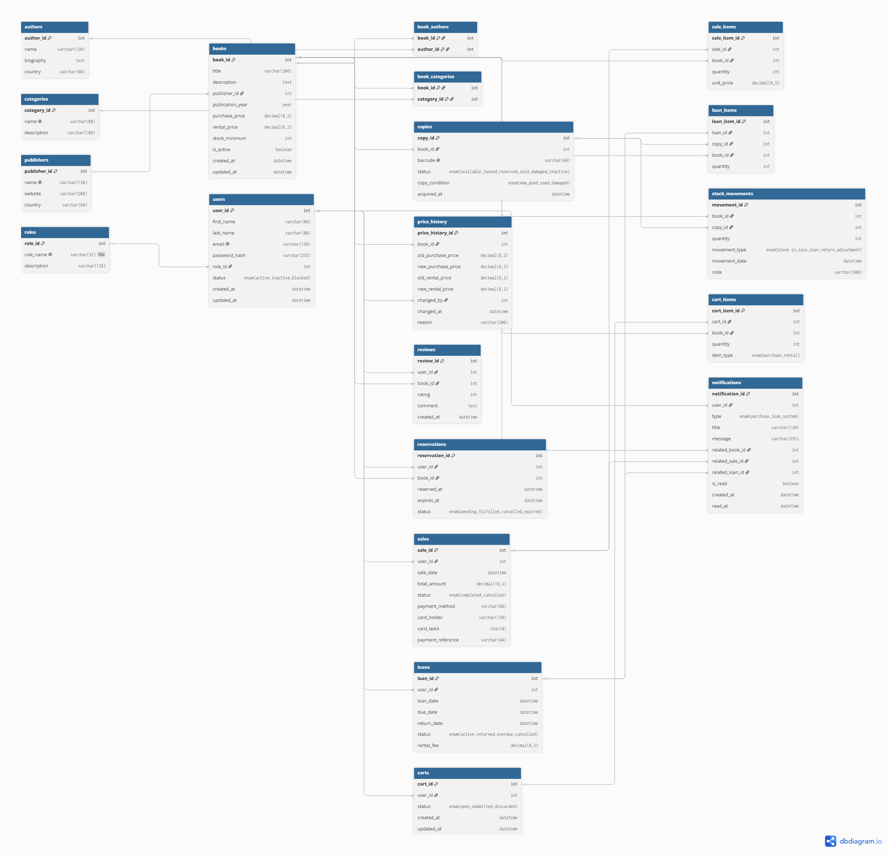
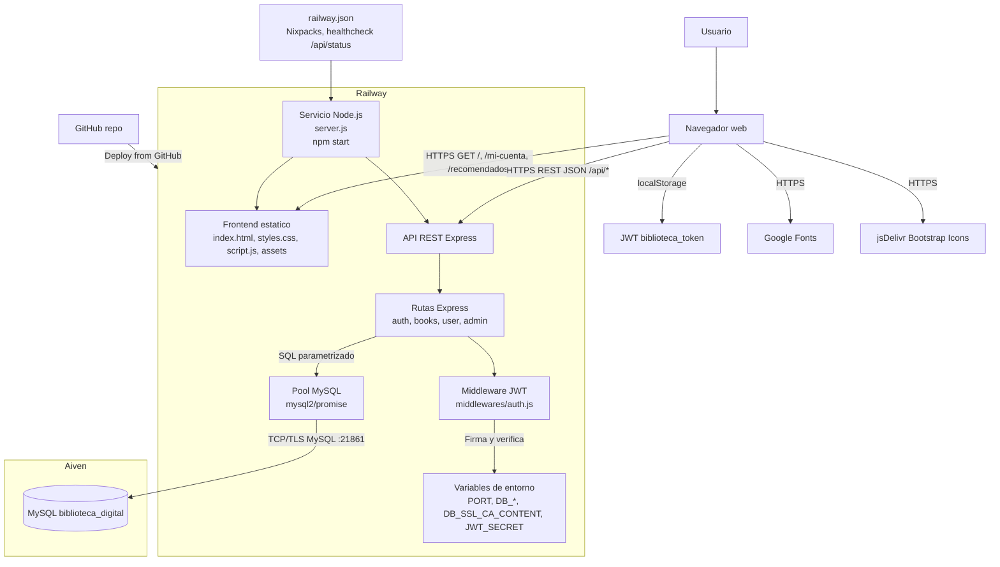

# Biblioteca Digital

## Ficha Tecnica

| Campo | Detalle |
| --- | --- |
| Proyecto | Biblioteca Digital / Biblioteca Online |
| Repositorio | `BibliotecaOnline` |
| Version | `1.0.0` |
| Tipo de sistema | Aplicacion web monolitica |
| Runtime | Node.js 18 o superior |
| Gestor de paquetes | npm |
| Backend | Node.js, Express 4 |
| Frontend | HTML, CSS, JavaScript vanilla |
| Base de datos | MySQL |
| Deploy documentado | Railway |
| Base administrada documentada | Aiven MySQL |

URL publica documentada: `https://bibliotecaonline-production.up.railway.app/`

Repositorio documentado: `https://github.com/PabloCannizzaro/BibliotecaOnline`

## Descripcion del Proyecto

Biblioteca Digital es una aplicacion web para consultar un catalogo de libros, registrarse, iniciar sesion, comprar libros, solicitar prestamos, dejar resenas y consultar informacion de cuenta.

El sistema tambien incluye un panel administrativo para gestionar libros, precios, stock, usuarios, ventas, prestamos activos y prestamos vencidos.

## Tecnologias Utilizadas

### Backend

- Node.js
- Express 4
- mysql2/promise
- JSON Web Token (`jsonwebtoken`)
- bcryptjs
- dotenv
- cors

### Frontend

- HTML
- CSS
- JavaScript vanilla
- Google Fonts
- Bootstrap Icons via jsDelivr

### Base de Datos

- MySQL / MariaDB compatible
- Modelo relacional normalizado
- Claves primarias y foraneas
- Tablas puente para relaciones muchos a muchos
- Pool de conexiones desde `config/db.js`
- Conexion TLS usando CA de Aiven

### Infraestructura

- Railway con builder Nixpacks
- Start command: `npm start`
- Healthcheck: `/api/status`
- Base MySQL administrada en Aiven, segun variables `DB_HOST`, `DB_PORT`, `DB_NAME` y certificado CA

## Funcionalidades Implementadas

### Usuarios

- Registro e inicio de sesion con JWT.
- Catalogo de libros con busqueda por texto y filtro por categoria.
- Vista de detalle de libro con autores, categorias, editorial, disponibilidad y resenas.
- Creacion de resenas para usuarios autenticados.
- Compra de libros con modal de tarjeta, validacion en frontend y validacion en backend.
- Registro de compras con stock actualizado y metadatos no sensibles de pago.
- Prestamo/alquiler de libros con actualizacion de ejemplares disponibles.
- Pagina independiente `/mi-cuenta` con datos del usuario, compras, prestamos activos e historial.
- Panel de notificaciones persistentes con badge de pendientes.
- Seccion independiente `/recomendados` con libros destacados desde el catalogo disponible.

### Administracion

- Dashboard con estadisticas generales.
- Gestion de libros.
- Alta y edicion de libros.
- Activacion y desactivacion de libros.
- Cambio de precios con historial.
- Alta de ejemplares y registro de movimientos de stock.
- Consulta de usuarios.
- Consulta de ventas.
- Consulta de prestamos activos y vencidos.
- Consulta de libros con bajo stock.

## Estructura del Repositorio

| Ruta | Descripcion |
| --- | --- |
| `server.js` | Inicializa Express, monta rutas API, sirve frontend y expone healthchecks. |
| `config/db.js` | Configura el pool MySQL con SSL/TLS. |
| `middlewares/auth.js` | Valida JWT y rol administrador. |
| `routes/authRoutes.js` | Registro e inicio de sesion. |
| `routes/bookRoutes.js` | Catalogo, filtros, detalle, autores, editoriales, categorias y resenas. |
| `routes/userRoutes.js` | Perfil, compras, prestamos, historial y notificaciones. |
| `routes/adminRoutes.js` | Dashboard, libros, stock, ventas, usuarios, prestamos e historial de precios. |
| `index.html` | Estructura del frontend. |
| `styles.css` | Estilos visuales, responsive, modales y animaciones. |
| `script.js` | Logica del frontend, consumo API, estado de sesion y rutas de UI. |
| `assets/` | SVG locales de portadas y avatar. |
| `bd/schema_reparado.sql` | Esquema completo de base de datos. |
| `bd/seed_reparado.sql` | Datos demo. |
| `bd/queries_test.sql` | Consultas de validacion. |
| `bd/migration_notifications_and_card_payments.sql` | Migracion para bases existentes. |
| `railway.json` | Configuracion de build/deploy en Railway. |
| `.env.example` | Variables de entorno de referencia. |

## Base de Datos

El esquema principal se encuentra en `bd/schema_reparado.sql`. La base se llama `biblioteca_digital` y contiene 20 tablas:

- `roles`
- `users`
- `authors`
- `publishers`
- `categories`
- `books`
- `book_authors`
- `book_categories`
- `copies`
- `price_history`
- `sales`
- `sale_items`
- `loans`
- `loan_items`
- `reviews`
- `stock_movements`
- `reservations`
- `carts`
- `cart_items`
- `notifications`

La compra utiliza `sales`, `sale_items`, `copies`, `stock_movements` y `notifications`. El backend no guarda numero completo de tarjeta ni CVV; solo guarda `card_holder`, `card_last4` y `payment_reference`.

Los prestamos utilizan `loans`, `loan_items`, `copies`, `stock_movements` y `notifications`.

Para bases ya creadas antes de estos cambios, aplicar una vez:

```sql
bd/migration_notifications_and_card_payments.sql
```

## DER



# Arquitectura del Sistema



El usuario interactua desde el navegador. El frontend es HTML/CSS/JavaScript servido por Express desde el mismo proceso Node.js. El frontend consume la API REST mediante rutas relativas `/api/*` y guarda el token JWT en `localStorage`.

El backend Express corre en Railway, monta las rutas de autenticacion, catalogo, usuario y administracion, y aplica el middleware JWT en rutas protegidas. La persistencia se realiza en MySQL administrado por Aiven usando `mysql2/promise` y conexion TLS con certificado CA.

El flujo general es: navegador -> frontend -> API REST -> rutas Express -> pool MySQL -> base de datos Aiven. Las compras y prestamos actualizan stock, registran movimientos y generan notificaciones.

## API Backend

### Estado

| Metodo | Ruta | Descripcion |
| --- | --- | --- |
| GET | `/api/status` | Estado general del servidor. |
| GET | `/api/health/env` | Estado de variables requeridas. |
| GET | `/api/health/db` | Prueba de conexion a base de datos. |

### Autenticacion

| Metodo | Ruta | Descripcion |
| --- | --- | --- |
| POST | `/api/auth/register` | Registra usuario y devuelve JWT. |
| POST | `/api/auth/login` | Inicia sesion y devuelve JWT. |

### Catalogo

| Metodo | Ruta | Descripcion |
| --- | --- | --- |
| GET | `/api/books/categories` | Lista categorias. |
| GET | `/api/books/authors` | Lista autores. |
| GET | `/api/books/publishers` | Lista editoriales. |
| GET | `/api/books` | Lista libros activos con busqueda y filtro por categoria. |
| GET | `/api/books/:id` | Detalle de libro, disponibilidad y resenas. |
| POST | `/api/books/:id/reviews` | Crea una resena. Requiere JWT. |

### Usuario Autenticado

| Metodo | Ruta | Descripcion |
| --- | --- | --- |
| GET | `/api/user/me` | Datos del usuario autenticado. |
| POST | `/api/user/purchases` | Registra compra con validacion de tarjeta y stock. |
| GET | `/api/user/purchases` | Lista compras del usuario. |
| POST | `/api/user/loans` | Registra prestamo. |
| GET | `/api/user/loans` | Lista prestamos. Acepta `status=active` o `status=history`. |
| GET | `/api/user/notifications` | Lista notificaciones y cantidad pendiente. |
| PATCH | `/api/user/notifications/read` | Marca notificaciones pendientes como leidas. |

### Administracion

Todas las rutas administrativas requieren JWT y rol `admin`.

| Metodo | Ruta | Descripcion |
| --- | --- | --- |
| GET | `/api/admin/stats` | Estadisticas generales. |
| GET | `/api/admin/dashboard` | Datos del dashboard administrativo. |
| GET | `/api/admin/books` | Lista libros para administracion. |
| GET | `/api/admin/books/low-stock` | Lista libros con bajo stock. |
| POST | `/api/admin/books` | Crea un libro. |
| PUT | `/api/admin/books/:id` | Actualiza un libro. |
| PATCH | `/api/admin/books/:id/status` | Activa o desactiva un libro. |
| POST | `/api/admin/books/:id/prices` | Actualiza precios y registra historial. |
| POST | `/api/admin/books/:id/copies` | Agrega ejemplares. |
| GET | `/api/admin/users` | Lista usuarios. |
| GET | `/api/admin/sales` | Lista ventas. |
| GET | `/api/admin/loans/active` | Lista prestamos activos. |
| GET | `/api/admin/loans/overdue` | Lista prestamos vencidos. |
| GET | `/api/admin/price-history` | Lista historial de precios. |

## Despliegue

El repositorio incluye `railway.json` con:

- Builder: `NIXPACKS`
- Start command: `npm start`
- Healthcheck: `/api/status`
- Restart policy: `ON_FAILURE`

Variables requeridas en Railway:

```env
PORT=4000
NODE_ENV=production
DB_HOST=bookonline00-114-pmccole14-ecdc.d.aivencloud.com
DB_PORT=21861
DB_USER=avnadmin
DB_PASSWORD=CONTRASENA_REAL_DE_AIVEN
DB_NAME=biblioteca_digital
DB_SSL_CA_CONTENT=CONTENIDO_COMPLETO_DEL_CA_PEM
JWT_SECRET=CLAVE_SECRETA_LARGA
```

Railway tambien puede definir `PORT` automaticamente. El servidor usa `process.env.PORT || 4000`.

## Seguridad y Consideraciones

- `.env` esta ignorado por Git.
- `DB_PASSWORD`, `JWT_SECRET` y certificados no deben subirse al repositorio.
- El backend redactoriza valores sensibles en logs de errores.
- Las contrasenas se guardan con hash bcrypt.
- Las rutas protegidas usan JWT Bearer.
- Las rutas administrativas requieren rol `admin`.
- Las consultas del backend usan parametros `?`.
- La compra no integra una pasarela de pago externa; valida datos de tarjeta y registra solo metadatos no sensibles.

# Ejecutar Localmente

## Requisitos

- Node.js 18 o superior.
- npm.
- Acceso a una base MySQL compatible.
- Certificado CA de Aiven en `certs/ca.pem` o contenido del certificado en `DB_SSL_CA_CONTENT`.

## Pasos

1. Clonar el repositorio:

```bash
git clone https://github.com/PabloCannizzaro/BibliotecaOnline.git
cd BibliotecaOnline
```

2. Instalar dependencias:

```bash
npm install
```

3. Crear `.env` desde `.env.example` y completar los valores reales:

```env
PORT=4000
NODE_ENV=development
DB_HOST=bookonline00-114-pmccole14-ecdc.d.aivencloud.com
DB_PORT=21861
DB_USER=avnadmin
DB_PASSWORD=REEMPLAZAR_PASSWORD
DB_NAME=biblioteca_digital
DB_SSL_CA=./certs/ca.pem
DB_SSL_CA_CONTENT=
JWT_SECRET=REEMPLAZAR_JWT_SECRET
```

4. Crear o actualizar la base:

Para una base nueva:

```text
bd/schema_reparado.sql
bd/seed_reparado.sql
```

Para una base existente que no tenga notificaciones ni campos de pago:

```text
bd/migration_notifications_and_card_payments.sql
```

5. Iniciar la aplicacion:

```bash
npm start
```

6. Abrir en el navegador:

```text
http://localhost:4000
```

Rutas utiles para validar:

```text
http://localhost:4000/api/status
http://localhost:4000/api/health/env
http://localhost:4000/api/health/db
http://localhost:4000/api/books
http://localhost:4000/mi-cuenta
http://localhost:4000/recomendados
```
